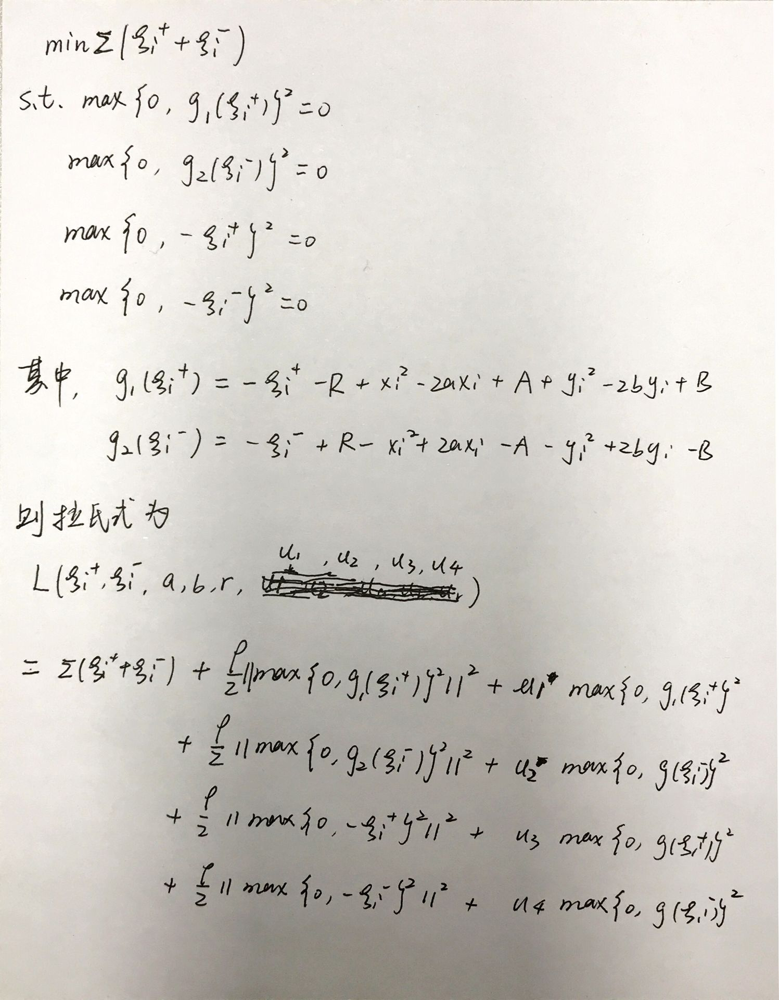
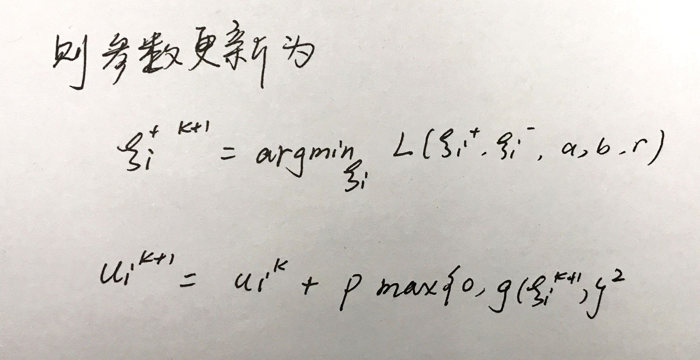

## 模式识别第三次实验

### 邹永浩 2019211168

#### 1. 公式

根据实验指导和 [Distributed Convex Optimization with Many Non-Linear Constraints](https://arxiv.org/pdf/1610.02967.pdf)，本次实验的相关公式如下：





#### 2. 代码

##### 主要约束 `g1` 和 `g2`

```python
# g1 和 g2
def g1(a, b, r, ksi1, x, y):
    return -ksi1 - r + x * x - 2 * a * x + a * a + y * y - 2 * b * y + b * b


def g2(a, b, r, ksi2, x, y):
    return -ksi2 + r - x * x + 2 * a * x - a * a - y * y + 2 * b * y - b * b

```

##### 参数迭代

```python

# 求梯度
grad_ksi1 = 0.1 + p * tmp_g1 * tmp_g1 * 2 * tmp_g1 * tmp_g1_ksi1 \
    + p * 2 * u1[k] * tmp_g1 * tmp_g1_ksi1 \
    + 2 * p * (max(0, -ksi1[k]) ** 3) * -1 \
    + 2 * u3[k] * (max(0, -ksi1[k])) * -1

grad_ksi2 = 0.1 + p * tmp_g2 * tmp_g2 * 2 * tmp_g2*tmp_g2_ksi2 \
    + p * 2 * u2[k] * tmp_g2 * tmp_g2_ksi2 \
    + 2 * p * (max(0, -ksi2[k]) ** 3) * -1 \
    + 2 * u4[k] * (max(0, -ksi2[k])) * -1

grad_r = p * tmp_g1 * tmp_g1 * 2 * tmp_g1 * tmp_g1_r \
    + p * 2 * u1[k] * tmp_g1 * tmp_g1_r \
    + p * tmp_g2 * tmp_g2 * 2 * tmp_g2 * tmp_g2_r \
    + p * 2 * u2[k] * tmp_g2 * tmp_g2_r

grad_a = p * tmp_g1 * tmp_g1 * 2 * tmp_g1 * tmp_g1_a \
    + p * 2 * u1[k] * tmp_g1 * tmp_g1_a \
    + p * tmp_g2 * tmp_g2 * 2 * tmp_g2 * tmp_g2_a \
    + p * 2 * u2[k] * tmp_g2 * tmp_g2_a

grad_b = p * tmp_g1 * tmp_g1 * 2 * tmp_g1 * tmp_g1_b \
    + p * 2 * u1[k] * tmp_g1 * tmp_g1_b \
    + p * tmp_g2 * tmp_g2 * 2 * tmp_g2 * tmp_g2_b \
    + p * 2 * u2[k] * tmp_g2 * tmp_g2_b

# 更新
ksi1[k] -= step * grad_ksi1
ksi1[k] = ksi1[k] if ksi1[k] > 0 else 0

ksi2[k] -= step * grad_ksi2
ksi2[k] = ksi2[k] if ksi2[k] > 0 else 0

r -= step * grad_r
a -= step * grad_a
b -= step * grad_b
```

##### 拉格朗日参数迭代

```python
tmp_g1 = max(0, g1(a, b, r, ksi1[k], x, y))
tmp_g2 = max(0, g2(a, b, r, ksi2[k], x, y))

# update u1, u2, u3, u4

u1[k] += p * tmp_g1 * tmp_g1

u2[k] += p * tmp_g2 * tmp_g2

u3[k] += p * max(0, -ksi1[k])

u4[k] += p * max(0, -ksi2[k])

```

#### 3. 结果

| data index | a | b | r |
-:|:-:|:-:|:-
| 0 | 0.9745374281009183 | 0.6235492104547817  | 0.08489968590589783 |
| 1 |0.7284045964651864|0.004988300763539417|0.08712502493068193|
| 2 |0.1326842217350493|0.6000539207299932|0.11622189887728795|
| 3 |0.7923196983268246|0.31831212759932553|0.2148619069738617|
| 4 |0.5451907892810237|0.974882989021801|0.5112548818541877|